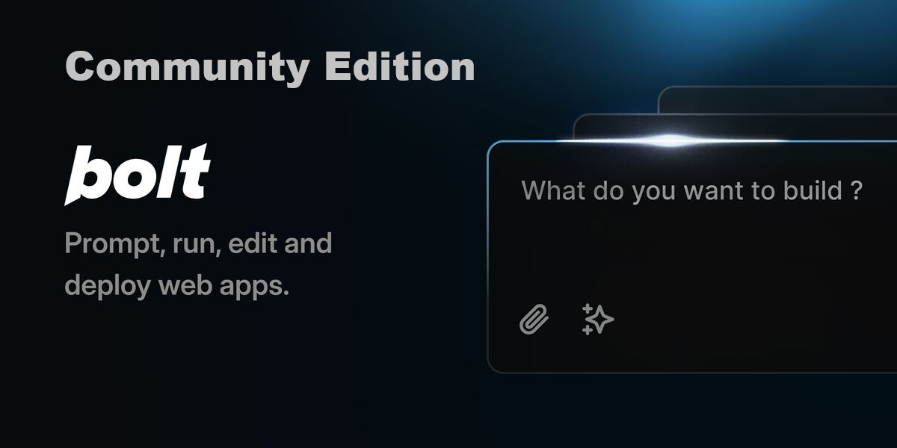

# FAQ

### How do I get the best results with Bolt?

- **Be specific about your stack**: If you want to use specific frameworks or libraries (like Astro, Tailwind, ShadCN, or any other popular JavaScript framework), mention them in your initial prompt to ensure Bolt scaffolds the project accordingly.

- **Use the enhance prompt icon**: Before sending your prompt, try clicking the 'enhance' icon to have the AI model help you refine your prompt, then edit the results before submitting.

- **Scaffold the basics first, then add features**: Make sure the basic structure of your application is in place before diving into more advanced functionality. This helps Bolt understand the foundation of your project and ensure everything is wired up right before building out more advanced functionality.

- **Batch simple instructions**: Save time by combining simple instructions into one message. For example, you can ask Bolt to change the color scheme, add mobile responsiveness, and restart the dev server, all in one go saving you time and reducing API credit consumption significantly.

### How do I contribute to Bolt?

[Please check out our dedicated page for contributing to Bolt here!](CONTRIBUTING.md)

### Do you plan on merging Bolt back into the official Bolt.new repo?

We have a base branch that we have submitted a pull request on 

### What are the future plans for Bolt?

A self hosted open source version with features that are simialar to the Bolt.new

### How do local LLMs fair compared to larger models like Claude 3.5 Sonnet for Bolt?

As much as the gap is quickly closing between open source and massive close source models, you’re still going to get the best results with the very large models like Claude 3.5 Sonnet. This is way we chose to stick with Claude 3.5 Sonnet for now.

### I'm getting the error: "There was an error processing this request"

If you see this error within Bolt, that is just the application telling you there is a problem at a high level, and this could mean a number of different things. To find the actual error, please check BOTH the terminal where you started the application (with Docker or pnpm) and the developer console in the browser. For most browsers, you can access the developer console by pressing F12 or right clicking anywhere in the browser and selecting “Inspect”. Then go to the “console” tab in the top right.

### I'm getting the error: "x-api-key header missing"

We have seen this error a couple times and for some reason just restarting the Docker container has fixed it. This seems to be Ollama specific. Another thing to try is try to run Bolt with Docker or pnpm, whichever you didn’t run first. We are still on the hunt for why this happens once and a while!

### I'm getting a blank preview when Bolt runs my app!

We promise you that we are constantly testing new PRs coming into Bolt and the preview is core functionality, so the application is not broken! When you get a blank preview or don’t get a preview, this is generally because the LLM hallucinated bad code or incorrect commands. We are working on making this more transparent so it is obvious. Sometimes the error will appear in developer console too so check that as well.